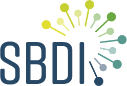
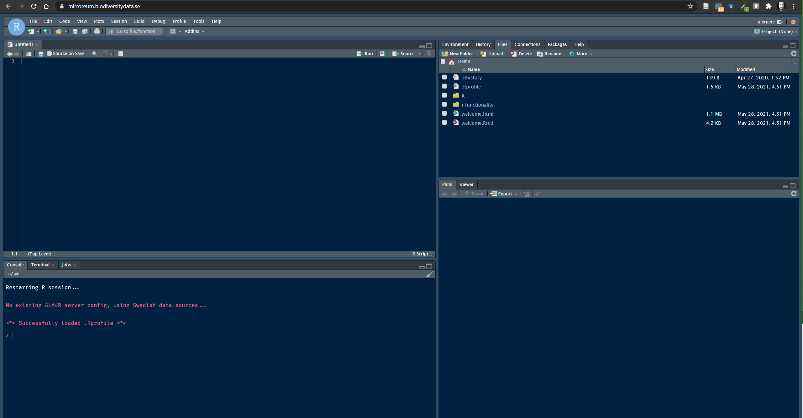

# Introduction {.unnumbered}

 Biodiversity resources are increasingly international. The SBDI has made an effort to canalise biodiversity data and resources to help the research community access and analyse Swedish primary biodiversity data. Each research question draws its own challenges which are unique in themselves. Our aim here is to provide a few examples that prompt questions that may be asked at different stages of the process. The validity and appropriateness of a particular method depends on the individual researcher(s). For a comprehensive workflow on how to treat and analyse primary biodiversity data please refer to our tutorial on [biodiversity analysis tools](https://github.com/biodiversitydata-se/biodiversity-analysis-tools) where we go through the complete workflow Data --\> Cleaning --\> Fitness evaluation --\> Analysis

`r htmltools::includeHTML("images/Workflow Overview Horizontal.html")`

## R and Mirroreum {.unnumbered}

The present tutorial is focused on the statistical programming language R. R is a free software environment for statistical computing and graphics that is widely used within the scientific community and where the complete analysis workflow can be documented in a fully reproducible way.

At SBDI we provide access for researchers and students to [Mirroreum](https://mirroreum.biodiversitydata.se/) -- an online web-based environment for Reproducible Open Research in the area of biodiversity analysis. Mirroreum is based on a Free and Open Source stack of software. Logging in, you immediately get access to a web-based version of R Studio with a large number of pre-installed packages such as all the packages offered from ROpenSci and more.

Compared to running R Studio on your own machine, Mirroreum offers more computational resources and a standardized environment where you can rely on all the relevant packages being installed and the configuration parameters being set appropriately. To know more about Mirroreum or to request an account please visit the [SBDI documentation site](https://docs.biodiversitydata.se/analyse-data/mirroreum/)

[](https://mirroreum.biodiversitydata.se/auth-sign-in)

## SBDI4R - an R 📦 to search an access data {.unnumbered}

The SBDI4R package enables the R community to directly access data and resources hosted by SBDI. The goal is to enable observations of species to be queried and output in a range of standard formats. It includes some filter functions that allow you to filter prior to download. It also includes some simple summary functions, and some function for some simple data exploration. The examples included in this tutorial also show you how you can continue exploring and analyzing using other R package.

Please refer to the [package documentation](https://biodiversitydata-se.github.io/SBDI4R) for details on how to install it. Once installed the SBDI4R package must be loaded for each new R session:

```{r, eval=FALSE}
library(SBDI4R)
```

```{r, echo=FALSE, include=FALSE}
library(SBDI4R)
library(sf)
library(BIRDS)
```

Various aspects of the SBDI4R package can be customized.

#### Caching {.unnumbered}

SBDI4R can cache most results to local files. This means that if the same code is run multiple times, the second and subsequent iterations will be faster. This will also reduce load on the web servers. By default, this caching is session-based, meaning that the local files are stored in a temporary directory that is automatically deleted when the R session is ended. This behavior can be altered so that caching is permanent, by setting the caching directory to a non-temporary location. For example, under Windows, use something like:

```{r, eval=FALSE}
sbdi_config(cache_directory = file.path("c:","mydata","sbdi_cache")) ## Windows
```

or for Linux:

```{r, eval=FALSE}
sbdi_config(cache_directory = "~/mydata/sbdi_cache") ## Linux
```

Note that this directory must exist (you need to create it yourself).

All results will be stored in that cache directory and will be used from one session to the next. They won't be re-downloaded from the server unless the user specifically deletes those files or changes the caching setting to "refresh".

If you change the cache_directory to a permanent location, you may wish to add something like this to your .Rprofile file, so that it happens automatically each time the SBDI4R package is loaded:

```{r, eval=FALSE}
setHook(packageEvent("SBDI4R", "onLoad"), 
        function(...) sbdi_config(cache_directory=file.path("~","mydata","sbdi_cache")))
```

Caching can also be turned off entirely by:

```{r}
sbdi_config(caching="off")
```

or set to "refresh", meaning that the cached results will re-downloaded from the SBDI servers and the cache updated. (This will happen for as long as caching is set to "refresh" --- so you may wish to switch back to normal "on" caching behavior once you have updated your cache with the data you are working on).

#### E-mail address {.unnumbered}

Each download request to SBDI servers is also accompanied by an "e-mail address" string that identifies the user making the request. You will need to provide an email address registered with the SBDI. You can create an account [here](https://auth.biodiversitydata.se/cas/login). Once an email is registered with the SBDI, it should be stored in the config:

```{r}
sbdi_config(email="your.valid@emailaddress.com")
```

Else you can provide this e-mail address as a parameter directly to each call of the function occurrences().

#### Setting the download reason {.unnumbered}

SBDI requires that you provide a reason when downloading occurrence data (via the SBDI4R `occurrences()` function). You can provide this as a parameter directly to each call of `occurrences()`, or you can set it once per session using:

```{r, eval=FALSE}
sbdi_config(download_reason_id = "your_reason_id")
```

(See `sbdi_reasons()` for valid download reasons, e.g. \* 3 for "education", \* 7 for "ecological research", \* 8 for "systematic research/taxonomy", \* 10 for "testing")

#### Privacy {.unnumbered}

***NO*** other personal identification information is sent. You can see all configuration settings, including the the user-agent string that is being used, with the command:

```{r, eval=FALSE}
sbdi_config()
```

#### Other options {.unnumbered}

If you make a request that returns an empty result set (e.g. an un-matched name), by default you will simply get an empty data structure returned to you without any special notification. If you would like to be warned about empty result sets, you can use:

```{r}
sbdi_config(warn_on_empty=TRUE)
```

## Other packages needed {.unnumbered}

Some additional packages are needed for these examples. Install them if necessary with the following script:

```{r, message=FALSE}
to_install <- c("colorRamps", "cowplot","dplyr","ggplot2", 
                "leaflet", "maps", "mapdata", "maptools", "sf", 
                "remotes","rgeos","tidyr", "xts")
to_install <- to_install[!sapply(to_install, 
                                 requireNamespace, 
                                 quietly=TRUE)]
if(length(to_install)>0)
    install.packages(to_install, 
                     repos="http://cran.us.r-project.org")

remotes::install_github("AtlasOfLivingAustralia/ALA4R")
remotes::install_github("Greensway/BIRDS")
```

## Your collaboration is appreciated {.unnumbered}

Open Source also means that you can contribute. You don't need to know how to program but every input is appreciated. Did you find something that is not working? Have suggestions for examples or text? you can always

1.  Reach to us via the [support center](https://docs.biodiversitydata.se/support/)
2.  Submit and issue to the GitHub code repository [see how](https://docs.github.com/en/github/managing-your-work-on-github/managing-your-work-with-issues-and-pull-requests/creating-an-issue)
3.  Or contribute with your code or documents modifications by ["forking"](https://docs.github.com/en/github/getting-started-with-github/quickstart/fork-a-repo) the code and submitting a ["pull request"](https://docs.github.com/en/github/collaborating-with-issues-and-pull-requests/proposing-changes-to-your-work-with-pull-requests/creating-a-pull-request-from-a-fork)

The repositories you can contribute to are:

-   Mirroreum <https://github.com/mskyttner/mirroreum>\
-   SBDI4R <https://github.com/biodiversitydata-se/SBDI4R> (NOTE: we may not develop this package but instead move to a new one)\
-   the general analysis workflows <https://github.com/biodiversitydata-se/biodiversity-analysis-tools>\
-   this R-tools tutorial <https://github.com/biodiversitydata-se/r-tools-tutorial>
