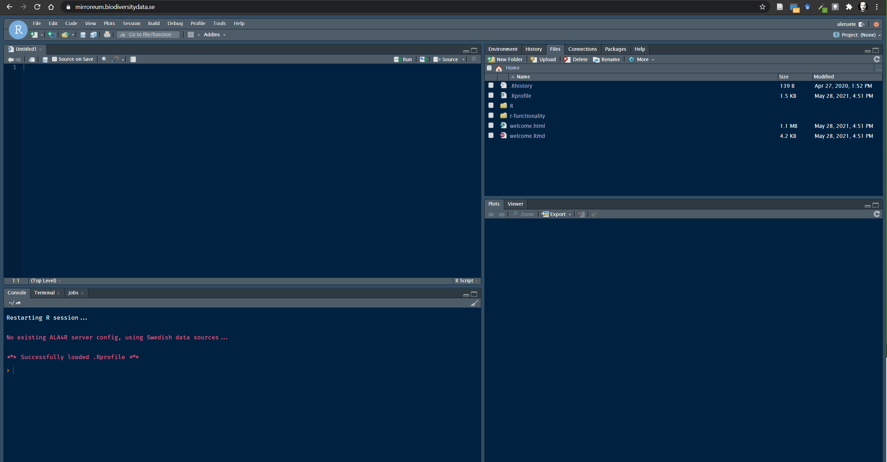

# Introduction {.unnumbered}

 Biodiversity resources are increasingly international. The SBDI has made an effort to canalise biodiversity data and resources to help the research community access and analyse Swedish primary biodiversity data. Each research question draws its own challenges which are unique in themselves. Our aim here is to provide a few examples that prompt questions that may be asked at different stages of the process. The validity and appropriateness of a particular method depends on the individual researcher(s). For a comprehensive workflow on how to treat and analyse primary biodiversity data please refer to our tutorial on [biodiversity analysis tools](https://github.com/biodiversitydata-se/biodiversity-analysis-tools) where we go through the complete workflow Data --\> Cleaning --\> Fitness evaluation --\> Analysis

`r htmltools::includeHTML("images/Workflow Overview Horizontal.html")`

## R and Mirroreum {.unnumbered}

The present tutorial is focused on the statistical programming language R. R is a free software environment for statistical computing and graphics that is widely used within the scientific community and where the complete analysis workflow can be documented in a fully reproducible way.

At SBDI we provide access for researchers and students to [Mirroreum](https://mirroreum.biodiversitydata.se/) -- an online web-based environment for Reproducible Open Research in the area of biodiversity analysis. Mirroreum is based on a Free and Open Source stack of software. Logging in, you immediately get access to a web-based version of R Studio with a large number of pre-installed packages such as all the packages offered from ROpenSci and more.

Compared to running R Studio on your own machine, Mirroreum offers more computational resources and a standardized environment where you can rely on all the relevant packages being installed and the configuration parameters being set appropriately. To know more about Mirroreum or to request an account please visit the [SBDI documentation site](https://docs.biodiversitydata.se/analyse-data/mirroreum/)

[](https://mirroreum.biodiversitydata.se/auth-sign-in)

## SBDI4R - an R 📦 to search an access data {.unnumbered}

The SBDI4R package enables the R community to directly access data and resources hosted by SBDI. The goal is to enable observations of species to be queried and output in a range of standard formats. It includes some filter functions that allow you to filter prior to download. It also includes some simple summary functions, and some function for some simple data exploration. The examples included in this tutorial also show you how you can continue exploring and analyzing using other R package.

Please refer to the [package documentation](https://biodiversitydata-se.github.io/SBDI4R) for details on how to install it. Once installed the SBDI4R package must be loaded for each new R session:

```{r, eval=FALSE}
library(SBDI4R)
```

```{r, echo=FALSE, include=FALSE}
library(SBDI4R)
library(sp)
library(BIRDS)
```

Various aspects of the SBDI4R package can be customized.

#### Caching {.unnumbered}

SBDI4R can cache most results to local files. This means that if the same code is run multiple times, the second and subsequent iterations will be faster. This will also reduce load on the web servers. By default, this caching is session-based, meaning that the local files are stored in a temporary directory that is automatically deleted when the R session is ended. This behavior can be altered so that caching is permanent, by setting the caching directory to a non-temporary location. For example, under Windows, use something like:

```{r, eval=FALSE}
sbdi_config(cache_directory = file.path("c:","mydata","sbdi_cache")) ## Windows
```

or for Linux:

```{r, eval=FALSE}
sbdi_config(cache_directory = "~/mydata/sbdi_cache") ## Linux
```

Note that this directory must exist (you need to create it yourself).

All results will be stored in that cache directory and will be used from one session to the next. They won't be re-downloaded from the server unless the user specifically deletes those files or changes the caching setting to "refresh".

If you change the cache_directory to a permanent location, you may wish to add something like this to your .Rprofile file, so that it happens automatically each time the SBDI4R package is loaded:

```{r, eval=FALSE}
setHook(packageEvent("SBDI4R", "onLoad"), 
        function(...) sbdi_config(cache_directory=file.path("~","mydata","sbdi_cache")))
```

Caching can also be turned off entirely by:

```{r}
sbdi_config(caching="off")
```

or set to "refresh", meaning that the cached results will re-downloaded from the SBDI servers and the cache updated. (This will happen for as long as caching is set to "refresh" --- so you may wish to switch back to normal "on" caching behavior once you have updated your cache with the data you are working on).

#### E-mail address {.unnumbered}

Each download request to SBDI servers is also accompanied by an "e-mail address" string that identifies the user making the request. You will need to provide an email address registered with the SBDI. You can create an account [here](https://auth.biodiversitydata.se/cas/login). Once an email is registered with the SBDI, it should be stored in the config:

```{r}
sbdi_config(email="your.valid@emailaddress.com")
```

Else you can provide this e-mail address as a parameter directly to each call of the function occurrences().

#### Setting the download reason {.unnumbered}

SBDI requires that you provide a reason when downloading occurrence data (via the SBDI4R `occurrences()` function). You can provide this as a parameter directly to each call of `occurrences()`, or you can set it once per session using:

```{r, eval=FALSE}
sbdi_config(download_reason_id = "your_reason_id")
```

(See `sbdi_reasons()` for valid download reasons, e.g. \* 3 for "education", \* 7 for "ecological research", \* 8 for "systematic research/taxonomy", \* 10 for "testing")

#### Privacy {.unnumbered}

***NO*** other personal identification information is sent. You can see all configuration settings, including the the user-agent string that is being used, with the command:

```{r, eval=FALSE}
sbdi_config()
```

#### Other options {.unnumbered}

If you make a request that returns an empty result set (e.g. an un-matched name), by default you will simply get an empty data structure returned to you without any special notification. If you would like to be warned about empty result sets, you can use:

```{r}
sbdi_config(warn_on_empty=TRUE)
```

## Other packages needed {.unnumbered}

Some additional packages are needed for these examples. Install them if necessary with the following script:

```{r, message=FALSE}
to_install <- c("BIRDS","colorRamps", "cowplot","dplyr","ggplot2", 
                "leaflet", "maps", "mapdata", "maptools", "sf", "sp",
                "rgeos", "tidyr", "xts")
to_install <- to_install[!sapply(to_install, 
                                 requireNamespace, 
                                 quietly=TRUE)]
if(length(to_install)>0)
    install.packages(to_install, 
                     repos="http://cran.us.r-project.org")
```

## Your collaboration is appreciated {.unnumbered}

Open Source also means that you can contribute. You don't need to know how to program but every input is appreciated. Did you find something that is not working? Have suggestions for examples or text? you can always

1.  Reach to us via the [support center](https://docs.biodiversitydata.se/support/)
2.  Submit and issue to the GitHub code repository [see how](https://docs.github.com/en/github/managing-your-work-on-github/managing-your-work-with-issues-and-pull-requests/creating-an-issue)
3.  Or contribute with your code or documents modifications by ["forking"](https://docs.github.com/en/github/getting-started-with-github/quickstart/fork-a-repo) the code and submitting a ["pull request"](https://docs.github.com/en/github/collaborating-with-issues-and-pull-requests/proposing-changes-to-your-work-with-pull-requests/creating-a-pull-request-from-a-fork)

The repositories you can contribute to are:

-   Mirroreum <https://github.com/mskyttner/mirroreum>\
-   SBDI4R <https://github.com/biodiversitydata-se/SBDI4R> (NOTE: we may not develop this package but instead move to a new one)\
-   the general analysis workflows <https://github.com/biodiversitydata-se/biodiversity-analysis-tools>\
-   this R-tools tutorial <https://github.com/biodiversitydata-se/r-tools-tutorial>

<!--chapter:end:index.Rmd-->

# Example with fish data from SERS

In this example we are interested in exploring data from a specific data resource -- the Swedish Electrofishing Registry - SERS (Department of Aquatic Resources, SLU Aqua). This database has 2.8 M observations starting in the 1950's.

SBDI is a collection of many biodiversity databases. We start by searching for the data resource we are interested in by using the function `pick_filter()`. This is an interactive query guiding you through the many resources available to filtering your query (data resources, spatial layers, and curated species lists).

```{r filter1, message=FALSE, eval=FALSE}
library(SBDI4R)
fq_str <- pick_filter("resource") 
# follow the instructions 
```

Follow the instructions. Your choices here would have been "in3" --> "dr10" (data resource 10 = SERS). Your variable `fq_str` will now contain a string "data_resource_uid:dr10".

```{r filter2, echo=FALSE, eval=TRUE}
# we can't do it interactive here so we force it
fq_str <- "data_resource_uid:dr10"
```

But we are not interested in the complete database, we only want to look at the data from the last 10 years. For this we concatenate (add to a vector) another filter string. Both filter strings (for data resource and for time period) will be treated as AND factors.

```{r filter3}
y1 <- 2008
y2 <- 2012
fq_str <- c(fq_str, paste0("year:[", y1, " TO ", y2,"]"))
# Note the square brackets are hard limits
```

For references on how to use the filters see the SBDI APIs [documentation](https://api.biodiversitydata.se/?lang=en-US#ws3).

Using the function `occurrences()` we can now query for the observations fulfilling our filter. If you haven't specified your email and the download reason in the `sbdi_config()` before, you need to pass this here.

```{r getOcc, cache=TRUE, message=FALSE}
xf <- occurrences(fq = fq_str,
                 email = "sbdi4r-test@biodiversitydata.se", 
                 download_reason_id = 10)

# Remove what is not a species
xf$data <- xf$data[xf$data$rank == "species",]

# Simply summarise all records by data source 
table(xf$data$dataResourceName)
```
```{r save, echo=FALSE, include=FALSE, eval=FALSE}
save(xf, file = "data/tmp_occdata_for compile.rdata")
```

```{r load, echo=FALSE, include=FALSE, eval=FALSE}
load(file = "data/tmp_occdata_for compile.rdata")
```

## Plotting data on a map
You can quickly plot all the observations as a PDF file with the function `ocurrence_plot()`, one page per species:
```{r pdf_plot, eval=FALSE}
occurrences_plot(xf, "obsPlot.pdf", 
                 grouped=FALSE, 
                 taxon_level="species", 
                 pch='.')
```

**Note** that the plot is saved to a .pdf file in the current working directory. You can find that with `getwd()`.

There are many other ways of producing spatial plots in R. The leaflet package provides a simple method of producing browser-based maps with panning, zooming, and background layers:

```{r leaflet, message=FALSE, warning=FALSE}
library(leaflet)
# drop any records with missing lat/lon values
xfl <- xf$data[!is.na(xf$data$longitude) | !is.na(xf$data$latitude),] 
marker_colour <- rep("#d95f02", nrow(xfl))
# blank map, with imagery background
leaflet(width = "100%") %>% 
  addProviderTiles("Esri.WorldImagery") %>%
  # add markers
  addCircleMarkers(xfl$longitude, xfl$latitude,  
                   radius = 1, 
                   fillOpacity =.5, 
                   opacity = 1,
                   col=marker_colour,
                  clusterOptions = markerClusterOptions())
```

## Temporal summary

A quick summary over the years reveals a drop in number of records over time.
```{r timeTable}
table(xf$data$year)
```

```{r timeHist}
hist(xf$data$year, 
     breaks = seq(y1, y2), 
     xlab = "Year", 
     main = "")
```

## Species summary
In the same way we can summarise the number of observations for each species, by common or scientific name.
```{r nObsTab, paged.print=TRUE}
sppTab <- table(xf$data$commonName)
sppDF <- as.data.frame(sppTab)
colnames(sppDF)[1] <- "species"
head(sppDF)
```

```{r nObsTab2, paged.print=TRUE}
sppTab <- table(xf$data$scientificName)
sppDF <- as.data.frame(sppTab)
colnames(sppDF)[1] <- "species"
head(sppDF)
```

Perhaps, you want to send this table as a .CSV file to a colleague. Save the table:

```{r savesummary, eval=FALSE}
write.csv(sppDF, "SERS_species_summary.csv")
# NOTE: again this will be saved on your working directory
```

## Spatial biodiversity analysis

Let's now ask: How does the species richness vary across Sweden? 

For this we want to summarise occurrences species-wise over a defined grid instead of plotting 
every observation point. First we need to overlay the observations with a grid. 
Here we are using the standard Swedish grids with grid square size of 50, 25, 10 or 5 km provided as 
data in the SBDI4R package (with Coordinate Reference System = WGS84, EPSG:4326).

```{r overlay, warning=FALSE, message=FALSE}
library(sp) # the function coordinates() and proj4string() are in sp
library(rgeos) # the function over() is in package rgeos
# load some shapes over Sweden's political borders
data("swe_wgs84", package="SBDI4R", envir=environment())
# a standard 50 km grid
data("Sweden_Grid_50km_Wgs84", package="SBDI4R", envir=environment())

grid <- Sweden_Grid_50km_Wgs84

# make the observations spatial
# NOTE: make sure there are no NAs in the columns defining the coordinates
# xf$data[!is.na(xf$data$longitude) | !is.na(xf$data$latitude),]

obs <- as.data.frame(xf$data)
coordinates(obs) <- obs[,c("longitude","latitude")]
wkt <- sf::st_crs(4326)[[2]]
proj4string(obs) <- sp::CRS(wkt) #CRS("+init=epsg:4326")
nObs <- nrow(obs)
# overlay the occurrence data with the grid
ObsInGridList <- over(grid, obs, returnList=TRUE)
wNonEmpty <- unname( which( unlist(lapply(ObsInGridList, nrow)) != 0) )
if(length(wNonEmpty)==0) message("Observations don't overlap any grid cell.")
```

The result `ObsInGridList` is a `list` object with a subset of the data for each grid cell. Now summarise occurrences within grid cells:

```{r overlay_summary}
# check n the total number of observations
sum(unlist(lapply(ObsInGridList, nrow)))

# apply a summary over the grid cells 
nCells <- length(ObsInGridList)
res <- data.frame("nObs"=as.numeric(rep(NA,nCells)),
                  "nYears"=as.numeric(rep(NA,nCells)),
                  "nSpp"=as.numeric(rep(NA,nCells)),
                  row.names = row.names(grid),
                  stringsAsFactors = FALSE)

cols2use <- c("scientificName", "year")
dataRes <- lapply(ObsInGridList[wNonEmpty], 
                  function(x){
                    x <- x[,cols2use]
                    colnames(x) <- c("scientificName", "year")
                    return(c("nObs" = length(x[,"scientificName"]),
                             "nYears" = length(unique(x[,"year"])),
                             "nSpp" = length(unique(x[,"scientificName"]))
                             )
                           )
                    }
                  )
dataRes <- as.data.frame(dplyr::bind_rows(dataRes, .id = "gridID"))
res[wNonEmpty,] <- dataRes[,-1]
resSp <- sp::SpatialPolygonsDataFrame(grid, res)
```

And finally plot the grid summary as a map:
```{r gridCode, eval=FALSE}
palBW <- leaflet::colorNumeric(c("white", "navyblue"),
                               c(0, max(resSp@data$nSpp, na.rm = TRUE)),
                               na.color = "transparent")
oldpar <- par()
par(mar = c(1,1,0,0))
plot(resSp, col=palBW(resSp@data$nSpp), border = NA)
plot(swe_wgs84$Border, border=1, lwd=1, add=T)
legend("bottomleft", 
       legend = round(seq(0, max(resSp@data$nSpp, na.rm = TRUE), length.out = 5)),
       col = palBW(seq(0, max(resSp@data$nSpp, na.rm = TRUE), length.out = 5)),
       title = "Number of \nspecies", pch = 15, bty="n")
par(oldpar)
```
```{r gridPlot, fig.height=6, fig.width=6, echo=FALSE}
palBW <- leaflet::colorNumeric(c("white", "navyblue"),
                               c(0, max(resSp@data$nSpp, na.rm = TRUE)),
                               na.color = "transparent")
oldpar <- par()
par(mar = c(1,1,0,0))
plot(resSp, col=palBW(resSp@data$nSpp), border = NA)
plot(swe_wgs84$Border, border=1, lwd=1, add=T)
legend("bottomleft", 
       legend = round(seq(0, max(resSp@data$nSpp, na.rm = TRUE), length.out = 5)),
       col = palBW(seq(0, max(resSp@data$nSpp, na.rm = TRUE), length.out = 5)),
       title = "Number of \nspecies", pch = 15, bty="n")
suppressWarnings(par(oldpar))
```

We may now ask wether species richness varies across latitude. So we go further by arranging the observations by latitude: 
```{r sppLatitude, warning=FALSE, message=FALSE}
library(dplyr)
library(tidyr)
xgridded <- xf$data %>%
    mutate(longitude = round(longitude * 4)/4, 
           latitude = round(latitude * 4)/4) %>%
    group_by(longitude,latitude) %>%
    ## subset to vars of interest
    select(longitude, latitude, species) %>%
    ## take one row per cell per species (presence)
    distinct() %>%
    ## calculate species richness
    mutate(richness=n()) %>%
    ## convert to wide format (sites by species)
    mutate(present=1) %>%
    do(tidyr::pivot_wider(data=.,  
                          names_from=species, 
                          values_from=present, 
                          values_fill=0)) %>%
    ungroup()
## where a species was not present, it will have NA: convert these to 0
sppcols <- setdiff(names(xgridded),
                   c("longitude", "latitude", "richness"))
xgridded <- xgridded %>% 
  mutate_at(sppcols, function(z) ifelse(is.na(z), 0, z))
```

And plot it accordingly:
```{r plot_richLat, warning=FALSE}
library(ggplot2)

ggplot(xgridded, aes(latitude, richness)) + 
  labs(x = "Latitude (º)", 
       y = "Species richness") +
  lims(y = c(0,20)) +
  geom_point() + 
  theme_bw()
```


<!-- ## Temporal biodiversity analysis -->
<!-- Despite the drop seen in sampling effort, we can still analyse whether there may be  -->
<!-- any trends for occurrence of species over the sampled years. To do this, we first need to  -->
<!-- check whether the spatial sampling effort was comparable across those years -->

<!-- ```{r temporalBiodiv} -->

<!-- xf$data %>% -->
<!--     ## discard genus- and higher-level records -->
<!--     filter(rank %in% c("species", "subspecies", "variety", "form", "cultivar")) %>%  -->
<!--     group_by(year) %>% -->
<!--     ## subset to vars of interest -->
<!--     select(year, locality) %>% -->
<!--     ## calculate species richness -->
<!--     mutate(nObs = n()) -->


<!-- ``` -->


<!-- And we ask: can we see a trend (change = frequency of occurrence = number caught) for species X, or species Y? -->

<!-- ## Links to further tutorials that could be of interest -->
<!-- Link to analyses of interest – e.g. species distribution models, or trend analyses, or species divesity – link to biodiversity workflow -->


<!--chapter:end:01-fish-data.Rmd-->

---
output: html_document
editor_options: 
  chunk_output_type: inline
---
# Example with opportunistic data on Dragonflies

In this example we are interested in exploring opportunistically collected data 
from the Swedish citizen science species observation portal - Artportalen.

## Name searching
To begin with, we want be sure there is an unequivocal way to find the species within 
the order Odonata (dragonflies) and nothing else, so let's search for "odonata":
```{r, echo=FALSE, warning=FALSE, message=FALSE, error=FALSE, include=FALSE}
library(SBDI4R)
```

```{r search1, echo=TRUE, eval=FALSE}
sx <- search_fulltext("odonata")
sx$data[, c("guid", "scientificName", "rank", "occurrenceCount")]
```  

```{r search1eval, echo=FALSE}
sx <- search_fulltext("odonata")
sx$data[, c("guid", "scientificName", "rank", "occurrenceCount")]
```  

We quickly see there that other taxonomic levels appear too, and also species that look suspiciously as not belonging to 
dragonsflies. But there is only one order. Let's refine the search. To know which search fields we can use 
to filter the search we use the function `sbdi_fields(fields_type = "general")`.
The search field we are looking for is "order_s".  
```{r search2,  echo=TRUE, eval=FALSE}
sx <- search_fulltext(fq="order_s:Odonata", page_size = 10)
sx$data[, c("scientificName", "rank", "occurrenceCount")]
```  
```{r search2eval, echo=FALSE}
sx <- search_fulltext(fq="order_s:Odonata", page_size = 10)
sx$data[, c("guid", "scientificName", "rank", "occurrenceCount")]
```  
Now we can download the taxonomic data (note that the search is case-sensitive):
```{r, message=FALSE, results=FALSE}
tx <- taxinfo_download("order_s:Odonata", 
                       fields = c("guid", "order_s","genus_s", "specificEpithet_s", 
                                  "scientificName",  "canonicalName_s", "rank"), 
                       verbose = FALSE)
tx <- tx[tx$rank == "species" & tx$genusS != "",] ## restrict to species and not hybrids
```
You can save the `tx` object as the complete species list for later use. 

## Filter the search to get the observations
We start by searching for the data resource we are interested in using 
the function `pick_filter()`. This is an interactive query guiding you through 
the many resources available to filtering your query (data resources, spatial 
layers, and curated species lists).

```{r filter2.1, message=FALSE, eval=FALSE}
# follow the instructions 
fq_str <- pick_filter("resource") 
``` 

Follow the instructions. Your choices here would have been "in3" --> "dr5". 
Your variable `fq_str` will now contain a string "data_resource_uid:dr5".

```{r filter2.2, echo=FALSE, eval=TRUE}
# we cant do it interactive here so we force it
fq_str <- "data_resource_uid:dr5"
```

We only want to look at data from year 2000 to 2010:
```{r filter2.3}
y1 <- 2000
y2 <- 2010
fq_str <- c(fq_str, paste0("year:[", y1, " TO ", y2,"]"))
# Note the square brackets are hard limits
```

We also want to filter spatially for Southern Sweden ([Götaland](https://en.wikipedia.org/wiki/G%C3%B6taland)).

Vector spatial layers (eg. polygons) can be imported  in a number of different ways. 
SBDI APIs take as search input polygons in the so-called WKT [Well Known Text](https://www.geoapi.org/3.0/javadoc/org/opengis/referencing/doc-files/WKT.html) 
format. So the first step is to load a vector layer and transform it into a WKT string. 
You could instead use the data we provid in the SBDI4R package `data("swe")`. 

```{r sweshape}
data("swe",package = "SBDI4R")
wGotaland <- swe$Counties$LnNamn %in% c("Blekinge", "Gotlands", "Hallands", 
                                        "Jönköpings", "Kalmar", "Kronobergs", 
                                        "Östergötlands", "Skåne", "Västra Götalands")
gotaland_c <- swe$Counties[wGotaland,]
```

There are details about this polygon that we need to take care before. The WKT 
string should not be too long to be accepted by the API service. Also, the polygon
we just got is projected in the coordinate system SWEREF99 TM, and the API service 
only accepts coordinates in a geodesic coordinate system WGS84. Let's construct 
the WKT string:
```{r searchpoly2WKT, warning=FALSE}
# transform the CRS
gotaland_c <- sf::as_Spatial(
                sf::st_transform(
                  sf::st_as_sf(gotaland_c), 
                  crs = sf::st_crs(4326)$wkt) )

# disolve the counties into one polygon
gotaland <- rgeos::gUnaryUnion(gotaland_c)

# extract the polygons coordinates
nPol <- length(gotaland@polygons[[1]]@Polygons) 
lonlat <- list()
for(p in seq(nPol)){
  lonlat[[p]] <- gotaland@polygons[[1]]@Polygons[[p]]@coords
}
lonlat <- do.call(rbind, lonlat)

# create a convex hull of the polygon to simplify the geometry and 
# reduce the length of the WKT string
gotaland_ch <- chull(lonlat)
lonlat <- lonlat[c(gotaland_ch, gotaland_ch[1]), ]

# create WKT string
# first join each lon-lat coordinate pair
wkt_temp <- apply(lonlat, 1, function(z) paste(round(z,4), collapse=" "))
# now build the WKT string
wkt <- paste("MULTIPOLYGON(((", paste(wkt_temp, collapse=","), ")))", sep="")
# NOTE: as of today, the SBDI APIs will only work properly if the polygon is 
# submitted as a MULTIPOLYGON
```
The WKT string then looks like this:
```{r, echo=FALSE}
wkt
```
```{r searchpoly, fig.width=7, echo=FALSE, warning=FALSE}
library(sp)
oldpar <- par()
par(mar = c(0,0,0,0))
plot(gotaland_c, border="blue")
plot(gotaland, lwd=2, add=TRUE)
plot(rgeos::readWKT(wkt), lwd=2, border="red", add=TRUE)
legend("bottomleft", inset = c(0,0.05),
       legend = c("counties", "Götaland", "search polygon"),
       col = c("blue","black", "red"),
       lwd = c(1,2,1),
       title = "Polygons",bty="n")
suppressWarnings(par(oldpar))
```

Next, we download the observations using the command `occurrences()`, but be aware that 
the search fields may not be the same as those used to search for taxa. We therefore
recommend using the function `sbdi_fields("occurrence")` to find out which search fields we can use 
to filter for occurrences. Here we see that the field 
we need this time is "order".

```{r getData, cache=TRUE}
xf <- SBDI4R::occurrences(taxon = "order:Odonata", 
                  fq = fq_str,
                  wkt = wkt,
                  extra = "collector",
                  email = "sbdi4r-test@biodiversitydata.se", 
                  download_reason_id = 10)
```
```{r localtmp, echo=FALSE, eval=FALSE}
save(xf, file = "data/tmp_occdata2_for compile.rdata")
load(file = "data/tmp_occdata2_for compile.rdata")
```
We have now downloaded the data locally and depending on your configuration this
will be cached on your computer. However, as the search and download could take
long time, we recommend to save the data locally. 
```{r save2, eval=FALSE}
save(xf, file = "an_approprieted_name.rdata")
load(file = "an_approprieted_name.rdata")
```
## Quality and fit-for-use check
Before we can use the observation records we need to know if the observation 
effort (sampling effort) has varied over time and in space. We can approximate observation effort from the data by 
defining field visits i.e. occasions at which an observer has sampled observations. We reconstruct field visits
(that is, assign each observation a visitUID) using using the package 
[BIRDS](https://greensway.github.io/BIRDS/). Additionally we want the data to be summarized 
over a grid of 25 km (provided through the SBDI4R package). The following functions 
will perform many different summaries at the same time. Please refer to the BIRDS package 
documentation for more detail. 

```{r birds, message=FALSE, warning=FALSE}
library(BIRDS)
```
```{r organisebirds, message=FALSE}
OB <- organiseBirds(xf$data, sppCol = "species" , 
                    # We only want observations identified at the species level
                    taxonRankCol = "rank", taxonRank = "species", 
                    # the visits are defined by collector and named locality
                    idCols = c("locality", "collector"), 
                    timeCols = c("year", "month", "day"), 
                    xyCols =c("longitude","latitude") )

# We don't need the whole grid, just the piece that overlaps our searching polygon
gotaland_grid25 <- raster::intersect(gotaland, Sweden_Grid_25km_Wgs84)

# This is another way of doing it.
# gotaland_grid25 <- gIntersection(gotaland,
#                                  spTransform(Sweden_Grid_25km_Wgs84, 
#                                              CRSobj = CRS(sf::st_crs(4326)$wkt)))

SB <- summariseBirds(OB, grid = gotaland_grid25, spillOver = "unique")
```

Once summarised, we can see over space and for a few selected years how the 
number of observations is distributed:
```{r plotBIRDSspatial_cose, eval=FALSE}
maxC <- max(SB$spatial@data$nObs, na.rm = TRUE)
palBW <- leaflet::colorNumeric(c("white", "navyblue"), 
                               c(0, maxC), 
                               na.color = "transparent")
oldpar <- par()
par(mar = c(1,1,1,1), mfrow=c(1,3))
plot(SB$spatial, col=palBW(SB$spatial@data$nObs),
     border = "grey", main="All years") ## with palette
legend("bottomleft", inset = c(0,0.05),
       legend = round(seq(0, maxC, length.out = 5)),
       col = palBW(seq(0, maxC, length.out = 5)),
       title = "Number of \nobservations", pch = 15, bty="n")

## or export other combinations, e.g. one map per observed year
yearlySp <- exportBirds(SB, 
                        dimension = "spatial", 
                        timeRes = "yearly", 
                        variable = "nObs", 
                        method = "sum")

maxC <- max(yearlySp@data$'2005', na.rm = TRUE)
palBW <- leaflet::colorNumeric(c("white", "navyblue"), 
                               c(0, maxC), 
                               na.color = "transparent")

plot(yearlySp["2005"], col=palBW(yearlySp@data$'2005'), 
     border = "grey",main="2005")
legend("bottomleft", inset = c(0,0.05),
       legend = round(seq(0, maxC, length.out = 5)),
       col = palBW(seq(0, maxC, length.out = 5)),
       border = "grey",
       title = "Number of \nobservations", pch = 15, bty="n")

maxC <- max(yearlySp@data$'2010', na.rm = TRUE)
palBW <- leaflet::colorNumeric(c("white", "navyblue"), 
                               c(0, maxC), 
                               na.color = "transparent")

plot(yearlySp["2010"], col=palBW(yearlySp@data$'2010'), 
     border = "grey",main="2010")
legend("bottomleft", inset = c(0,0.05),
       legend = round(seq(0, maxC, length.out = 5)),
       col = palBW(seq(0, maxC, length.out = 5)),
       border = "grey",
       title = "Number of \nobservations", pch = 15, bty="n")
par(oldpar)
```
```{r plotBIRDSspatial, echo=FALSE, fig.width=8}
maxC <- max(SB$spatial@data$nObs, na.rm = TRUE)
palBW <- leaflet::colorNumeric(c("white", "navyblue"), 
                               c(0, maxC), 
                               na.color = "transparent")
oldpar <- par()
par(mar = c(1,1,1,1), mfrow=c(1,3))
plot(SB$spatial, col=palBW(SB$spatial@data$nObs),
     border = "grey", main="All years") ## with palette
legend("bottomleft", inset = c(0,0.05),
       legend = round(seq(0, maxC, length.out = 5)),
       col = palBW(seq(0, maxC, length.out = 5)),
       title = "Number of \nobservations", pch = 15, bty="n")

## or export other combinations, e.g. one map per observed year
yearlySp <- exportBirds(SB, 
                        dimension = "spatial", 
                        timeRes = "yearly", 
                        variable = "nObs", 
                        method = "sum")

maxC <- max(yearlySp@data$'2005', na.rm = TRUE)
palBW <- leaflet::colorNumeric(c("white", "navyblue"), 
                               c(0, maxC), 
                               na.color = "transparent")

plot(yearlySp["2005"], col=palBW(yearlySp@data$'2005'), 
     border = "grey",main="2005")
legend("bottomleft", inset = c(0,0.05),
       legend = round(seq(0, maxC, length.out = 5)),
       col = palBW(seq(0, maxC, length.out = 5)),
       border = "grey",
       title = "Number of \nobservations", pch = 15, bty="n")

maxC <- max(yearlySp@data$'2010', na.rm = TRUE)
palBW <- leaflet::colorNumeric(c("white", "navyblue"), 
                               c(0, maxC), 
                               na.color = "transparent")

plot(yearlySp["2010"], col=palBW(yearlySp@data$'2010'), 
     border = "grey",main="2010")
legend("bottomleft", inset = c(0,0.05),
       legend = round(seq(0, maxC, length.out = 5)),
       col = palBW(seq(0, maxC, length.out = 5)),
       border = "grey",
       title = "Number of \nobservations", pch = 15, bty="n")
suppressWarnings(par(oldpar))
```

We now want to use the number of field visits as the measure
for sampling effort. And since there are other ways to plot spatial data, we this time
use the package `sf` instead of `sp`:  
```{r ggplot1, message=FALSE, warning=FALSE, fig.width=8}
library(sf)
library(cowplot)
library(ggplot2)
library(colorRamps)
library(gridExtra)

spatial_sf <- st_as_sf(SB$spatial)

vis <- ggplot(data = spatial_sf, aes( fill = nVis)) +
  geom_sf() +
  ggtitle("Visits") +
  scale_fill_gradient(low = "#56B1F7",
                      high = "#132B43",
                      na.value = NA) +
  theme(plot.margin = margin(1, 1, 1, 1, "pt")) +
  theme_cowplot()

spp <- ggplot(data = spatial_sf ,aes( fill = nSpp))+
  geom_sf()+
  ggtitle("Number of species")+
  scale_fill_gradient(low = "#56B1F7",
                      high = "#132B43",
                      na.value = NA) +
  theme(plot.margin = margin(1, 1, 1, 1, "pt")) +
  theme_cowplot()

grid.arrange(vis, spp, ncol=2)
```

#### Temporal check
We see that `SB` contains an element called `SB$temporal` that contains a daily 
time series with time-specific rows when there is information. `xts` also supports 
day time, but dating below day resolution is not yet implemented in the `BIRDS` package.  

```{r temporal}
sb.xts <- SB$temporal
head(sb.xts, 5)
```

Sub-setting is convenient in `xts` as you can do it with its dates and with a `/` 
for a range of dates.  
```{r subsetting, message=FALSE, warning=FALSE}
sb.xts["2010-09-07"] #a specific day
sb.xts["2010-09-01/2010-09-15"] #for a period
sb.xts["2010-09"] #a specific month
```

The package `xts` has several tools for converting to different time periods. 
Here we use `apply.monthly` to obtain the total number of observations and visits
per month. The plot command for an object of calss `xts` provides a many features. 
This makes it fairly easy to customize your plots. Read more in `?plot.xts`.  

```{r monthlyPlotcode, eval=FALSE}
library(xts)
obs.m <- apply.monthly(sb.xts$nObs, "sum", na.rm = TRUE)

# alternative for more summary options but slower
# obs.m <- exportBirds(SB,
#                      dimension = "temporal",
#                      timeRes = "monthly",
#                      variable = "nObs",
#                      method = "sum")

plot(obs.m, 
     col = "darkblue", 
     grid.ticks.on = "month", 
     major.ticks = "year", 
     grid.col = "lightgrey",  
     main = "Total number of daily observations and visits per month")

vis.m <- apply.monthly(sb.xts$nVis, "sum", na.rm = TRUE)
lines(vis.m, col = "orange", lwd=2, on=1)
```

```{r monthlyPlot, echo=FALSE, include=FALSE}
library(xts)
obs.m <- apply.monthly(sb.xts$nObs, "sum", na.rm = TRUE)

plot(obs.m, 
     col = "darkblue", 
     grid.ticks.on = "month", 
     major.ticks = "year", 
     grid.col = "lightgrey",  
     main = "Total number of daily observations and visits per month")

vis.m <- apply.monthly(sb.xts$nVis, "sum", na.rm = TRUE)
lines(vis.m, col = "orange", lwd=2, on=1)
```
```{r, echo=FALSE, fig.width=8}
addLegend("topleft", c("Observations", "Visits"), 
          col=c("darkblue","orange"), 
          lwd=2)
```

## Species trends
We can now look at some particular species and ask whether those have changed in 
occurrence over time:
```{r sppTrends, message=FALSE}
speciesSummary(SB)[,1:4]
```
We pick two species and compare their trends in number of visits where the species where reported, relative to the total number of visits.

```{r trends, fig.width=8}
library(dplyr)
sppCountLq <- obsData(OB) %>% 
            group_by(year,visitUID) %>% 
            summarise("focalCount" = sum(scientificName == "Libellula quadrimaculata"),
                      "sppLength" = length(unique(scientificName)), 
                      .groups = "drop") %>% 
            ungroup() %>% 
            group_by(year) %>% 
            summarise("focalCount" = sum(focalCount),
                      "nVis" = length(unique(visitUID)), 
                      .groups = NULL)

sppCountLq$relCount <- sppCountLq$focalCount/sppCountLq$nVis

sppCountSd <- obsData(OB) %>% 
            group_by(year,visitUID) %>% 
            summarise("focalCount" = sum(scientificName == "Sympetrum sanguineum"),
                      "sppLength" = length(unique(scientificName)), 
                      .groups = "drop") %>% 
            ungroup() %>% 
            group_by(year) %>% 
            summarise("focalCount" = sum(focalCount),
                      "nVis" = length(unique(visitUID)), 
                      .groups = NULL)

sppCountSd$relCount <- sppCountSd$focalCount/sppCountSd$nVis

oldpar <- par(no.readonly = TRUE)
par(mar=c(4,4,1,1), las=1)
plot(sppCountLq$year, sppCountLq$relCount, type = "l", 
     lwd = 3, xlab = "Year", ylab = "Relative number of visits with observations", 
     ylim=c(0, max(sppCountLq$relCount)), xaxp=c(2000, 2010, 10))
lines(sppCountSd$year, sppCountSd$relCount, lwd=3, col="#78D2EB")
legend("bottomright", 
       legend=c("Libellula quadrimaculata","Sympetrum sanguineum"), 
       text.font = 3, col = c("black", "#78D2EB"), lwd = 3, bty = "n")
par(oldpar)
```

<!-- Plot no. gridcells with visits for species x and no. gridcells with visits for all species over years (we simply explore by comparing records for a species with no visits, can assume that species has increased of stronger positive trend than for no. visits) -->
<!-- (species x: Tvåfläckad trollslända Epitheca bimaculata) -->

<!-- ```{r} -->
<!-- sppCountGrid <- lapply(SB$overlaid, function(x, focalSpp="Libellula quadrimaculata"){ -->
<!--   tmp <- x %>%  -->
<!--             group_by(year, visitUID) %>%  -->
<!--             summarise("focalCount" = sum(scientificName == focalSpp), -->
<!--                       "sppLength" = length(unique(scientificName)), -->
<!--                       .groups = "drop") %>%  -->
<!--             ungroup() %>%  -->
<!--             group_by(year) %>%  -->
<!--             summarise("focalCount" = sum(focalCount), -->
<!--                       "nVis" = length(unique(visitUID)),  -->
<!--                       .groups = NULL) -->
<!--   res <- as.data.frame(tmp) -->
<!--   return(res) -->
<!-- } ) -->

<!-- sppCountGrid <- bind_rows(sppCountGrid, .id = "grid_label") -->
<!-- sppCountGrid %>%  -->
<!--             group_by(year, grid_label) %>%  -->
<!--             summarise("ngrid"= length(unique(grid_label)), -->
<!--                       "ngridSpp" = ,  -->
<!--                       .groups = "drop") -->
<!-- ``` -->

<!--chapter:end:02-dragonflies-data.Rmd-->

